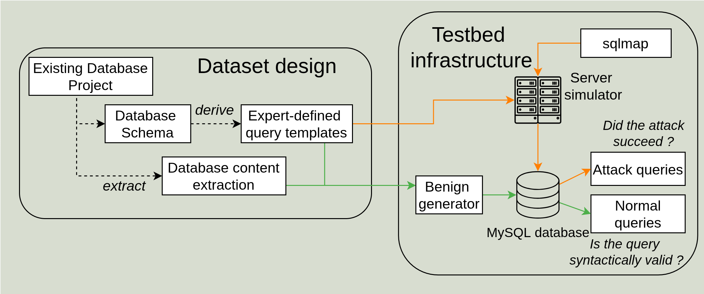

# Cross-domain SQL attack Dataset Generator

This repository contains the code used to generate high-quality SQL attack Datasets for evaluating unsupervised detection systems. Samples are built using query templates filled with legitimate values (normal samples) and [sqlmap](https://github.com/sqlmapproject/sqlmap/tree/1.8.7)-generated payloads (attack samples). This codebase was used to generate the [Superviz26-SQL Dataset](https://zenodo.org/records/19627322).

## Dataset Generation Strategy

This generator creates realistic SQL attack detection datasets through controlled emulation of web application endpoints and database attacks. It produces labelled datasets suitable for training and evaluating unsupervised anomaly detection systems.

<p align="center">
  
</p>

The dataset generation relies on **query templates** filled with legitimate values for normal samples and sqlmap-generated payloads for attack samples. Templates are SQL queries with placeholders enclosed in curly brackets:

```sql
SELECT * FROM airport WHERE icao_code = '{airports_icao_code}'
```

### Attack Sample Generation

#### SQL Injection Attacks

SQL injection samples are generated by simulating HTTP endpoints and launching sqlmap attack campaigns. For each endpoint:

1. **HTTP endpoint simulation**: A random subset of query templates is selected (mimicking applications where not all endpoints are externally accessible)
1. **Attack campaigns**: 6 campaigns per endpoint, each using a different sqlmap technique
1. **Two-phase attacks**:
   - **Reconnaissance**: sqlmap identifies working payloads with correct prefix/suffix combinations
   - **Exploit**: Data exfiltration using cached payloads (only if reconnaissance succeeds)

For diversity and realism, we leverage:

- `--eval`: Executes code before payload generation to provide diverse HTTP parameter values
- `--tamper`: Applies mutation scripts to bypass validation mechanisms

Example sqlmap invocation (reconnaissance phase):

```bash
sqlmap -v 3 --skip-waf --level=5 --risk=1 --batch \
  --skip='user-agent,referer,host' \
  --eval="import random;rand_medium_pos_number=random.choice([1119, 2223, 4662, 4035, 1104, 1387, 1005, 2743, 1376, 3825]);" \
  -p 'countries_code' \
  -tamper="space2comment" \
  --technique=Q \
  -u "http://localhost:8080/airport-S22?rand_medium_pos_number=3702&countries_code=LA"
```

All samples generated during campaigns are collected and included in the test set.

**Note on data exfiltration scope**: To reduce generation time, exploit phases use targeted exfiltration flags (`--users`, `--banner`, `--schema`, `--current-user`) instead of `--all`. To generate payloads that dump complete database contents (tables, columns, data), modify the techniques dictionary in the `generate_attacks` function in `src/sqlia_generator.py`.

**Database isolation**: Each dataset is generated with only its own database present in the MySQL instance. The launcher starts an isolated MySQL server, creates the database (`init_dataset_db`), runs generation, then stops the server (`stop_mysql_server` via `mysql-stop --clean`). This prevents sqlmap from enumerating unrelated schemas during `--schema` extraction, which would otherwise inflate boolean-based blind queries disproportionately.

#### Insider Threat Attacks

Insider attack samples are generated using sqlmap's direct connection mode with various enumeration objectives, simulating [insider threat](https://doi.org/10.1007/978-3-030-93956-4_11) campaigns.

### Normal Sample Generation

Normal samples are generated by filling templates with values from dictionaries. Configuration parameters:

- `attacks_ratio`: Proportion of attacks in the test set (e.g., 0.1 means 10% attacks, 90% normal). The training set always contains as many normal samples as there are attacks.
- `normal_only_template_ratio`: Reserves a proportion of templates for normal-only generation (never used to generate attacks), ensuring pattern diversity between attack and normal samples. Set to 0 to disable.

Example normal sample:

```sql
SELECT * FROM airport WHERE icao_code = 'LFPN'
```

## Development

For development, or generating a dataset given other dataset specifications, we provide a Nix shell environment. Enter it using:

```bash
nix-shell
```

The environment contains all runtime dependencies and adds the `scripts/` directory to your `PATH`. The launcher **manages MySQL automatically** (start/stop per dataset), so no manual MySQL setup is required to run generation.

Alternatively, an equivalent environment can be manually created using the following software versions:

- MySQL 8.4.5
- sqlmap 1.9.4
- pt-kill 3.2.0
- python 3.13, the dependency packages versions used are further detailed in requirements.txt.

Then, initialize MySQL as follows:

```bash
$ mkdir /usr/local/mysqld_1/
$ mysqld --initialize-insecure --basedir=/usr/local/mysqld_1/ --datadir=/usr/local/mysqld_1/datadir/
$ mysqld --basedir=/usr/local/mysqld_1/ --datadir=/usr/local/mysqld_1/datadir/ --port=61337 --daemonize
$ mysql -u root --skip-password --host=localhost --port=61337 -e "ALTER USER 'root'@'localhost' IDENTIFIED BY 'root'";
```

Initialize the unprivileged user using [bootstrap.sql](data/bootstrap.sql):

```bash
$ mysql --user=root --password=root --host=localhost --port=61337 < ./data/bootstrap.sql
```

This creates the unprivileged user required for query validation and sqlmap attacks. Dataset databases are created on-demand during generation (one at a time, for isolation).

### Creating New Datasets

To generate a dataset with a different database schema, you need:

- **Query templates**: CSV files with `template`, `ID`, and optional `description` columns. Placeholders use `{curly_braces}` and must match dictionary filenames.
- **Dictionaries**: Text files containing legitimate values, one per line.

Optionally, you can include SQL scripts of normal queries. This is useful when you already have small dumps of normal queries. For each statement type, annotate templates with `-- template-ID` comments (see [OHR script](data/datasets/OHR/insert.sql) for an example). The tool measures the template repartition and generates additional samples to meet the configured target count while respecting it.

Create a folder under `data/datasets/` containing:

```
data/datasets/<dataset_name>/
├── init_db.sql          # Database schema definition
├── conditions.toml      # Optional: Variable-condition definitions
├── dicts/               # Dictionary files (one per placeholder)
├── queries/*.csv        # CSV templates (required)
└── *.sql                # Optional: Raw SQL with -- template-ID annotations
```

#### Variable-Condition Templates

Templates can use the special `{conditions}` placeholder to generate queries with a variable number of WHERE conditions. This simulates search forms where users fill different combinations of fields. To use this feature, create a `conditions.toml` file in the dataset directory defining which tables support variable conditions, which columns to use, and their types.

Each field can be typed (auto-generates patterns from `string`/`numeric`/`date` type) or custom (explicit pattern list for special cases like `FIND_IN_SET`):

```toml
[[table]]
name = "film"
select_columns = "film_id"
min_conditions = 2
max_conditions = 6

  [[table.field]]
  column = "title"
  dict = "film_title"
  type = "string"          # Auto-generates: =, LIKE, IN patterns

  [[table.field]]
  column = "release_year"
  dict = "film_release_year"
  type = "numeric"         # Auto-generates: =, >=, <=, BETWEEN patterns
```

Then add a template using `{conditions}` in the corresponding `queries/select.csv`:

```csv
"SELECT film_id FROM film WHERE {conditions}",sakila-S12,Search films using a flexible set of filter conditions.
```

During normal generation, the generator picks a random number of fields (within `[min_conditions, max_conditions]`) and a random pattern per field. For attack generation, one concrete condition set is frozen so sqlmap can inject into the resulting placeholders.

Add the dataset to `config.toml` under `[[datasets]]`, then validate it with the test suite:

```bash
mysql-start
pytest tests/test_database_schemas.py -v
```

#### Running Generation

Test your setup with a small subset (a few templates, error-based technique only):

```bash
python3 ./launcher.py --config-file config.toml --testing
```

If everything works fine, generate the complete dataset:

```bash
python3 ./launcher.py --config-file config.toml
```

Additional options:

- `--debug`: Verbose output with sqlmap payload details (verbosity level 3)
- `--no-syn-check`: Skip syntax validation of normal queries (faster generation)
- `--output-dir`: Specify output directory (default: `./output/`)
- `--ithreat-only`: Generate only insider threat attacks

**Note**: Random seeds are not fixed for sqlmap to preserve payload diversity. Generated datasets are structurally similar but may differ slightly in attack samples across runs.

### Testing

The repository includes integration tests which can be run using:

```bash
pytest
```

The tests approximately takes 10min to run.

## Datasets

### Superviz26-SQL

[Superviz26-SQL](https://zenodo.org/records/19627322) is a cross-domain dataset spanning four application domains: **OurAirports** (aviation), **sakila** (DVD rental), **AdventureWorks** (bicycle sales ERP), and **OHR** (human resources). It was designed to evaluate the transfer-learning capabilities of SQL injection detection models across domains.

**Citation**: TODO.

To reproduce, enter the Nix shell and run the launcher for each domain using the current TOML-based configuration. However, the generation of the dataset is sequential, generating the 4 datasets as follows might take a lot of time (days). Consider invoking in parallel different configurations.

```bash
nix-shell
python3 ./launcher.py --config-file config.toml
```

The in-domain and LODO splits were then generated using the [generate_splits](experiments/generate_splits.py) script.

```bash
python3 experiments/generate_splits.py --output-dir ~/datasets/test/ --seed 2
```

<!-- ### Superviz25-SQL

[Superviz25-SQL](https://zenodo.org/records/17086037) is a single-domain dataset built on the **OurAirports** database schema (aviation domain). It was published at ANUBIS 2025.

**Citation**:

```bibtex
@inproceedings{quetel:hal-05314211,
  TITLE = {{Superviz25-SQL: High-Quality Dataset to Empower Unsupervised SQL Injection Detection Systems}},
  AUTHOR = {Quetel, Gregor and Alata, Eric and Gimenez, Pierre-Francois and Robert, Thomas and Pautet, Laurent},
  URL = {https://hal.science/hal-05314211},
  BOOKTITLE = {{ANUBIS 2025 - 1st International Workshop on Assessment with New methodologies, Unified Benchmarks, and environments, of Intrusion detection and response Systems}},
  ADDRESS = {Toulouse, France},
  PAGES = {1-20},
  YEAR = {2025},
  MONTH = Sep,
  PDF = {https://hal.science/hal-05314211v1/file/anubis.pdf},
  HAL_ID = {hal-05314211},
  HAL_VERSION = {v1},
}
```

To reproduce, use the Docker container which reflects the older INI-based configuration used for that release:

```bash
docker pull ghcr.io/gquetel/sqlia-dataset:1.0.0
docker run -it ghcr.io/gquetel/sqlia-dataset:1.0.0
```

Inside the container:

```bash
./setup-mysql.sh
python3 ./launcher.py --ini ini.ini   # --testing for a quick test
```

Full dataset generation takes approximately 10 hours. -->

## Detection Models

The `models/` directory implements SQL attack detection pipelines used to evaluate in-domain and cross-domain detection performance. All studied pipelines can be found in [`models/registry.py`](models/registry.py).

**Feature extractors** range from hand-crafted SQL-specific feature sets (Li, Loginov, GAUR, Kakisim) and token-frequency baselines (CountVectorizer) to transformer-based embeddings (SecureBERT, ModernBERT, CodeBERT, CodeT5, Qwen3-Embedding, and others).

**Novelty detectors** are One-Class SVM, Local Outlier Factor, and Autoencoder combined with extractors to form named pipelines (e.g. `ae_li`, `ocsvm_securebert`).

Two evaluation protocols are supported:

- **In-domain**: train and test on the same domain.
- **LODO**: train on three domains, test on the held-out fourth (leave-one-domain-out).

To run in-domain or LODO experiments, use [`scripts/submit_experiments.py`](scripts/submit_experiments.py), which generates and submits (or runs) training and evaluation scripts for each scenario. It internally calls `models/training.py` for training and `experiments/evaluate_model.py` for evaluation. Use `--local` to run locally; without it, scripts are submitted to SLURM via `sbatch`.

```bash
# Quick local test (limits samples)
python3 scripts/submit_experiments.py --model ae_li --mode lodo --local --testing

# Run all LODO scenarios locally for a given model
python3 scripts/submit_experiments.py --model ae_li --mode lodo --local

# Run all in-domain scenarios on SLURM
python3 scripts/submit_experiments.py --model ae_li --mode in_domain
```

See [`models/README.md`](models/README.md) for the full list of models, CLI options, and caching details.

## Experiments

The `experiments/` directory contains scripts for dataset analysis: dataset statistics, diversity metrics (lexical, syntactic, semantic). It also contains script to analyse models performances: LODO vs. in-domain performance comparisons, recall heatmaps per attack technique and statement type, and transfer-learning matrices. See [`experiments/readme.md`](experiments/readme.md) for a description of each script and example commands.
