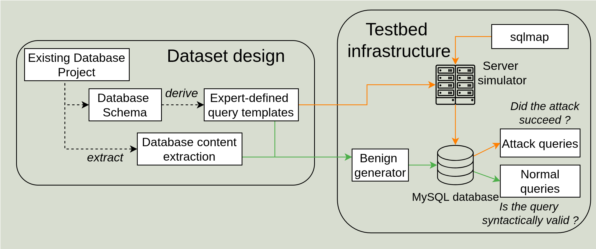

# SQL Injection Detection Dataset Generator

This repository contains the code used to generate high-quality SQL injection detection datasets for evaluating unsupervised detection systems. Samples are built using query templates filled with legitimate values (normal samples) and [sqlmap](https://github.com/sqlmapproject/sqlmap/tree/1.8.7)-generated payloads (attack samples).

The generator ships **four application domains** out of the box:  **OurAirports** (aviation), **sakila** (DVD rental), **AdventureWorks** (bicycle-sales ERP) and **OHR** (human resources), and merges them into a single criss-domain dataset. The single-domain [Superviz25-SQL Dataset](https://zenodo.org/records/17086037), published at ANUBIS 2025, was generated with an earlier version of this codebase (see [Reproducing Superviz25-SQL](#reproducing-superviz25-sql)).

## Dataset Generation Strategy

This generator creates realistic SQL injection detection datasets through controlled emulation of web application endpoints and database attacks. It produces labelled datasets suitable for training and evaluating unsupervised anomaly detection systems.

<p align="center">
  
</p>

The dataset generation relies on **query templates** filled with legitimate values for normal samples and sqlmap-generated payloads for attack samples. Templates are SQL queries with placeholders enclosed in curly brackets:

```sql
SELECT * FROM airport WHERE icao_code = '{airports_icao_code}'
```

### Attack Sample Generation

#### SQL Injection Attacks

SQL injection samples are generated by simulating HTTP endpoints and launching sqlmap attack campaigns. For each endpoint:

1. **HTTP endpoint simulation**: A random subset of query templates is selected (mimicking applications where not all endpoints are externally accessible)
1. **Attack campaigns**: 6 campaigns per endpoint, each using a different sqlmap technique
1. **Two-phase attacks**:
   - **Reconnaissance**: sqlmap identifies working payloads with correct prefix/suffix combinations
   - **Exploit**: Data exfiltration using cached payloads (only if reconnaissance succeeds)

For diversity and realism, we leverage:

- `--eval`: Executes code before payload generation to provide diverse HTTP parameter values
- `--tamper`: Applies mutation scripts to bypass validation mechanisms

Example sqlmap invocation (reconnaissance phase):

```bash
sqlmap -v 3 --skip-waf --level=5 --risk=1 --batch \
  --skip='user-agent,referer,host' \
  --eval="import random;rand_medium_pos_number=random.choice([1119, 2223, 4662, 4035, 1104, 1387, 1005, 2743, 1376, 3825]);" \
  -p 'countries_code' \
  -tamper="space2comment" \
  --technique=Q \
  -u "http://localhost:8080/airport-S22?rand_medium_pos_number=3702&countries_code=LA"
```

All samples generated during campaigns are collected and included in the test set.

**Note on data exfiltration scope**: To reduce generation time, exploit phases use targeted exfiltration flags (`--users`, `--banner`, `--schema`, `--current-user`) instead of `--all`. To generate payloads that dump complete database contents (tables, columns, data), you should modify the techniques dictionary in the `generate_attacks` function in `src/sqlia_generator.py`.

#### Insider Threat Attacks

Insider attack samples are generated using sqlmap's direct connection mode with various enumeration objectives, simulating [insider threat](https://doi.org/10.1007/978-3-030-93956-4_11) campaigns.

### Normal Sample Generation

Normal samples are generated by filling templates with values from dictionaries. Configuration parameters:

- `attacks_ratio`: Proportion of attacks in the test set (e.g., 0.1 means 10% attacks, 90% normal). The training set always contains as many normal samples as there are attacks.
- `normal_only_template_ratio`: Reserves a proportion of templates for normal-only generation (never used to generate attacks), ensuring pattern diversity between attack and normal samples. Set to 0 to disable.

Example normal sample:

```sql
SELECT * FROM airport WHERE icao_code = 'LFPN'
```

More details are available in the paper: [Superviz25-SQL: High-Quality Dataset to Empower Unsupervised SQL Injection Detection Systems](https://hal.science/hal-05314211).


## Development

For development, or generating a dataset given other dataset specifications, we provide a Nix shell environment. Enter it using `nix-shell`. The environment contains all the runtime dependencies to generate such datasets and adds the `scripts/` directory to your `PATH`.

The launcher **manages MySQL automatically**: for each dataset it starts an isolated MySQL instance, creates the database, runs generation, then stops the server and wipes its data. No manual MySQL setup is required to run generation.

The `scripts/` helpers remain available for manual use — for example when validating a new schema with the test suite (see [Creating New Datasets](#creating-new-datasets)):

```bash
mysql-start        # Initialize and start the local MySQL dev server (port 61337, runs bootstrap.sql on first init)
mysql-stop         # Stop the MySQL dev server
mysql-stop --clean # Stop MySQL and remove all data
```

Alternatively, an equivalent environment can be manually created by using the following software versions:

- MySQL 8.4.5
- sqlmap 1.9.4
- pt-kill 3.2.0
- python 3.13, the dependency packages versions used are pinned in `pyproject.toml` / `uv.lock` (managed with [uv](https://docs.astral.sh/uv/)).

Then, you could initialize MySQL as follows:

```bash
$ mkdir /usr/local/mysqld_1/
$ mysqld --initialize-insecure --basedir=/usr/local/mysqld_1/ --datadir=/usr/local/mysqld_1/datadir/
$ mysqld --basedir=/usr/local/mysqld_1/ --datadir=/usr/local/mysqld_1/datadir/ --port=61337 --daemonize
$ mysql -u root --skip-password --host=localhost --port=61337 -e "ALTER USER 'root'@'localhost' IDENTIFIED BY 'root'";
```

Initialize database content using [bootstrap.sql](data/bootstrap.sql):

```bash
$ mysql --user=root --password=root --host=localhost --port=61337 < ./data/bootstrap.sql
```

This creates the unprivileged user required for query validation and sqlmap attacks. Dataset databases are created on-demand during generation (one at a time, for isolation).

### Creating New Datasets

To generate a dataset with different database schema, we require the following inputs:

- **Query templates**: in the form of CSV files. The file must contain the fields `template`, `ID`, optional `description` columns with `{placeholders}`.
- **Dictionaries**: Text files containing legitimate values, one per line

Optionally, you can include SQL scripts of normal queries as inputs. This is typically useful when you already possess small dumps of normal queries. Then, for each type of statement, write the associated template and labels the queries using comments (See [OHR script](data/datasets/OHR/insert.sql) for an example). Then, the tool will measure the repartition of templates. If more samples are required than those provided in the script, the tool will generate more using the normal samples and the template while respecting the specified template repartition.

In practice, you should create a folder under `data/datasets/` containing:

```
data/datasets/<dataset_name>/
├── init_db.sql          # Database schema definition
├── dicts/               # Dictionary files (one per placeholder)
├── queries/*.csv        # CSV templates (required)
├── conditions.toml      # Optional: search conditions for the {conditions} placeholder
└── *.sql                # Optional: Raw SQL with -- template-ID annotations
```

#### Variable-Condition Templates

Templates may use the special `{conditions}` placeholder, which is expanded into a randomly selected set of valid `WHERE` search conditions for the target table (simulating search forms where users fill different combinations of fields). The available tables, columns, operators and value pools are declared per dataset in `conditions.toml` and handled by `src/condition_generator.py`.

Each field is either typed (auto-generates patterns from `string` / `numeric` / `date`) or custom (an explicit pattern list for special cases such as `FIND_IN_SET`):

```toml
[[table]]
name = "film"
select_columns = "film_id"
min_conditions = 2
max_conditions = 6

  [[table.field]]
  column = "title"
  dict = "film_title"
  type = "string"          # Auto-generates: =, LIKE, IN patterns

  [[table.field]]
  column = "release_year"
  dict = "film_release_year"
  type = "numeric"         # Auto-generates: =, >=, <=, BETWEEN patterns
```

Then add a template using `{conditions}`, for instance:

```csv
"SELECT film_id FROM film WHERE {conditions}",sakila-S12,Search films using a flexible set of filter conditions.
```

During normal generation, the generator picks a random number of fields (within `[min_conditions, max_conditions]`) and a random pattern per field. For attack generation, one concrete condition set is frozen so sqlmap can inject into the resulting placeholders.

The `admin` statement type (see `queries/admin.csv` and the `admin_*` dictionaries) models privileged/administrative queries.

You can test your specification through the `pytest` test suite by parametrizing the test functions in [test_launcher_integration](tests/test_database_schemas.py) with your dataset name.

Then, adjust the generation configuration options present the in `config.toml` file. They are as follows:

- **General settings**: `attacks_ratio`, `normal_only_template_ratio`, `seed`, `output_path`
- **MySQL connection**: `user`, `password`, `host`, `port`, privileged credentials
- **Dataset definitions**: Name, statement type proportions (must sum to 1), and an optional `port_offset`. Each dataset runs in its own isolated MySQL instance on `port + port_offset` (and HTTP server on `8080 + port_offset`), so datasets can be generated concurrently without port collisions.

Then, you can test your setup with a small subset (a few templates, error-based technique only):

```bash
python3 ./launcher.py --config-file config.toml --testing
```

If everything works fine, you can generate the complete dataset:

```bash
python3 ./launcher.py --config-file config.toml
```

#### Additional Options

- `--debug`: Verbose output with sqlmap payload details (verbosity level 3)
- `--no-syn-check`: Skip syntax validation of normal queries (faster generation)
- `--output-dir`: Specify output directory (default: `./output/`)
- `--ithreat-only`: Generate only insider threat attacks
- `--normal-only`: Generate only normal (benign) queries, skipping the sqlmap attack stages
- `--normal-count`: Number of normal samples per dataset in `--normal-only` mode (default: 400000)

**Note**: Random seeds are not fixed for sqlmap to preserve payload diversity. Therefore, generated datasets are structurally similar but may differ slightly in attack samples.

### Deriving Evaluation Sub-Datasets

We provide scripts that turn the generated datasets in ready-to-use train/test splits under different  transfer-learning setting. These scripts expect a path to the fully-generated dataset (default is `~/datasets/superviz26-full/`). The few-shot and "big" builders read the LODO output, so generate that one first.

| Script                                                                                       | Produces                                                                  | Use it to evaluate                                    |
| -------------------------------------------------------------------------------------------- | ------------------------------------------------------------------------- | ----------------------------------------------------- |
| [`generate_splits.py`](experiments/generate_splits.py)                                       | In-domain (`a-a`…`d-d`) and leave-one-domain-out (`bcd-a`…`abc-d`) splits | Cross-domain generalisation to an unseen domain       |
| [`build_concept_drift.py`](experiments/alternative_datasets_builders/build_concept_drift.py) | Per-domain train/test where test templates are unseen at training         | Robustness to concept drift within a fixed domain     |
| [`build_fsl.py`](experiments/alternative_datasets_builders/build_fsl.py)                     | In-domain test sets paired with a 100k-benign fine-tuning pool            | Few-shot adaptation to a target domain                |
| [`build_big_trainsets.py`](experiments/alternative_datasets_builders/build_big_trainsets.py) | LODO train sets doubled with freshly generated benign queries             | Whether more training data further improves detection |